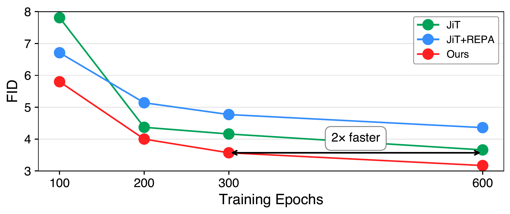
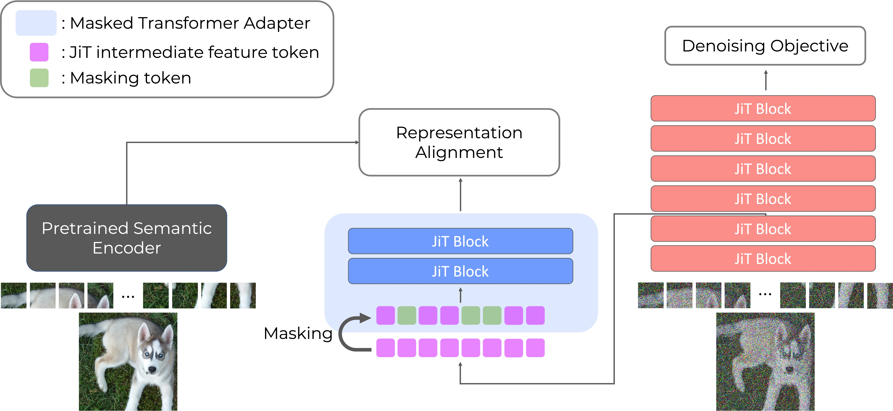

# PixelREPA: Representation Alignment for Just Image Transformers is not Easier than You Think


<div align="center">
  <a href="https://scholar.google.co.kr/citations?user=UbZM7nQAAAAJ&hl=ko&oi=ao" target="_blank">Jaeyo&nbsp;Shin</a><sup>*</sup> &ensp; <b>&middot;</b> &ensp;
  <a href="https://jw-kim.netlify.app/" target="_blank">Jiwook&nbsp;Kim</a><sup>*</sup> &ensp; <b>&middot;</b> &ensp;
  <a href="https://scholar.google.co.kr/citations?user=KB5XZGIAAAAJ&hl=ko" target="_blank">Hyunjung&nbsp;Shim</a> <br>
  KAIST AI &emsp;<br>
  <sup>*</sup>Equal Contribution &emsp; <br>
</div>
<br/>

<p align="center">
  <a href="https://arxiv.org/abs/2603.14366">
    
  </a>
</p>

This repository is a PyTorch official code of the paper [Representation Alignment for Just Image Transformers is not Easier than You Think](https://arxiv.org/abs/2603.14366).

## News & Updates
  - [x] **[2026/03/17]** 📝 Our paper is now available! The paper is released [here](https://arxiv.org/abs/2603.14366).
  - [x] **[2026/03/16]** 🧑‍💻 Our code is released!

## PixelREPA

<p align="center">
  
</p>

PixelREPA aligns JiT intermediate features to the feature space of an external semantic encoder using our Masked Transformer Adapter (MTA), instead of an MLP.
This alternative design accelerates training speed of JiT.
The detailed design is described as a following figure:
<br />

<p align="center">
  
</p>


## 1. Environment setting and Dataset Preparation

### Code Download

```bash
git clone https://github.com/kaist-cvml/PixelREPA.git
cd PixelREPA
```

### Dataset Download

Download [ImageNet-10k](https://image-net.org/download).

### Conda Environment
```bash
conda env create -f environment.yaml
conda activate pixelrepa
```


If you get ```undefined symbol: iJIT_NotifyEvent``` when importing ```torch```, simply
```bash
pip uninstall torch
pip install torch==2.5.1 --index-url https://download.pytorch.org/whl/cu124
```
Check this [issue](https://github.com/conda/conda/issues/13812#issuecomment-2071445372) for more details.

## 2. Training

We trained on 8 NVIDIA H200 GPUs.

Here is the training script on ImageNet 256x256 for 600 epochs:

1. PixelREPA-B/16
```bash
  torchrun --nproc_per_node=8 --nnodes=1 --node_rank=0 \
    main_pixelREPA.py \
    --model JiT-B/16 \
    --mta MTA-B/16 \
    --proj_dropout 0.0 \
    --P_mean -0.8 --P_std 0.8 \
    --img_size 256 --noise_scale 1.0 \
    --batch_size 128 --blr 5e-5 \
    --epochs 600 --warmup_epochs 5 \
    --gen_bsz 128 --num_images 50000 --cfg 3.1 --interval_min 0.1 --interval_max 1.0 \
    --output_dir ${OUTPUT_DIR} --resume ${OUTPUT_DIR} \
    --data_path ${IMAGENET_PATH} --online_eval --eval_freq 10
```

2. PixelREPA-L/16
```bash
  torchrun --nproc_per_node=8 --nnodes=1 --node_rank=0 \
    main_pixelREPA.py \
    --model JiT-L/16 \
    --mta MTA-L/16 \
    --proj_dropout 0.0 \
    --P_mean -0.8 --P_std 0.8 \
    --img_size 256 --noise_scale 1.0 \
    --batch_size 128 --blr 5e-5 \
    --epochs 600 --warmup_epochs 5 \
    --gen_bsz 128 --num_images 50000 --cfg 2.8 --interval_min 0.1 --interval_max 1.0 \
    --output_dir ${OUTPUT_DIR} --resume ${OUTPUT_DIR} \
    --data_path ${IMAGENET_PATH} --online_eval --eval_freq 10
```

3. PixelREPA-H/16
```bash
  torchrun --nproc_per_node=8 --nnodes=1 --node_rank=0 \
    main_pixelREPA.py \
    --model JiT-H/16 \
    --mta MTA-H/16 \
    --proj_dropout 0.2 \
    --P_mean -0.8 --P_std 0.8 \
    --img_size 256 --noise_scale 1.0 \
    --batch_size 128 --blr 5e-5 \
    --epochs 600 --warmup_epochs 5 \
    --gen_bsz 128 --num_images 50000 --cfg 2.4 --interval_min 0.1 --interval_max 1.0 \
    --output_dir ${OUTPUT_DIR} --resume ${OUTPUT_DIR} \
    --data_path ${IMAGENET_PATH} --online_eval --eval_freq 10
```

## 3. Inference

Pre-trained models are available [here](https://drive.google.com/drive/folders/1TzFxFcqKzRfwkNo6AvndROMlIr8GmM3i?usp=sharing).

1. PixelREPA-B/16
```bash
  torchrun --nproc_per_node=8 --nnodes=1 --node_rank=0 \
    main_pixelREPA.py \
    --model JiT-B/16 \
    --mta MTA-B/16 \
    --img_size 256 --noise_scale 1.0 \
    --gen_bsz 128 --num_images 50000 --cfg 3.1 --interval_min 0.1 --interval_max 1.0 \
    --output_dir ${CKPT_DIR} --resume ${CKPT_DIR} \
    --data_path ${IMAGENET_PATH} --evaluate_gen
```

2. PixelREPA-L/16
```bash
  torchrun --nproc_per_node=8 --nnodes=1 --node_rank=0 \
    main_pixelREPA.py \
    --model JiT-L/16 \
    --mta MTA-L/16 \
    --img_size 256 --noise_scale 1.0 \
    --gen_bsz 128 --num_images 50000 --cfg 2.8 --interval_min 0.1 --interval_max 1.0 \
    --output_dir ${CKPT_DIR} --resume ${CKPT_DIR} \
    --data_path ${IMAGENET_PATH} --evaluate_gen
```

3. PixelREPA-H/16
```bash
  torchrun --nproc_per_node=8 --nnodes=1 --node_rank=0 \
    main_pixelREPA.py \
    --model JiT-H/16 \
    --mta MTA-H/16 \
    --img_size 256 --noise_scale 1.0 \
    --gen_bsz 128 --num_images 50000 --cfg 2.4 --interval_min 0.1 --interval_max 1.0 \
    --output_dir ${CKPT_DIR} --resume ${CKPT_DIR} \
    --data_path ${IMAGENET_PATH} --evaluate_gen
```

## Acknowledgement

Our code is strongly based on [JiT](https://github.com/LTH14/JiT). We sincerely appreciate to the following works:
  - [JiT](https://github.com/LTH14/JiT)
  - [REPA](https://github.com/sihyun-yu/REPA)

## Citation

```bibtex
@misc{shin2026pixelrepa,
      title={Representation Alignment for Just Image Transformers is not Easier than You Think}, 
      author={Jaeyo Shin and Jiwook Kim and Hyunjung Shim},
      year={2026},
      eprint={2603.14366},
      archivePrefix={arXiv},
      primaryClass={cs.CV},
      url={https://arxiv.org/abs/2603.14366}, 
}
```
